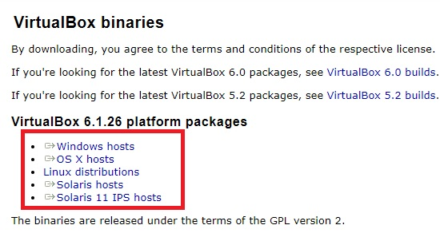
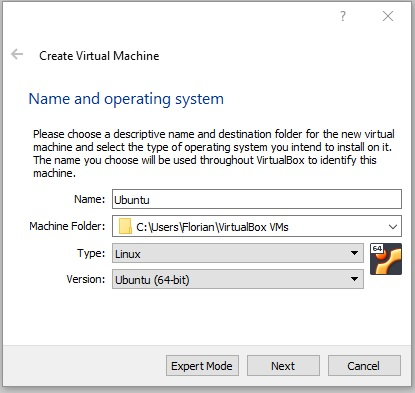
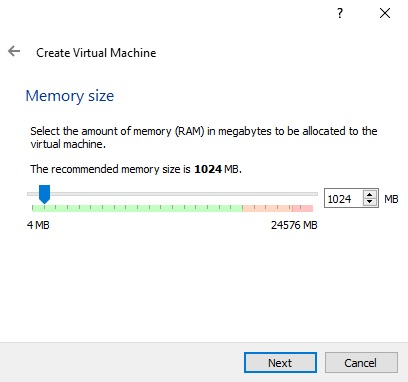
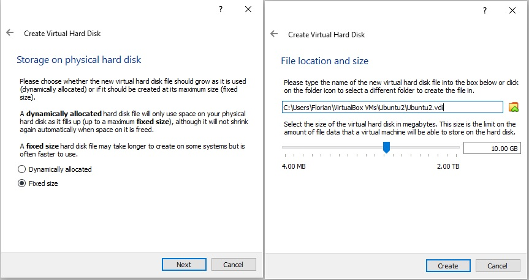
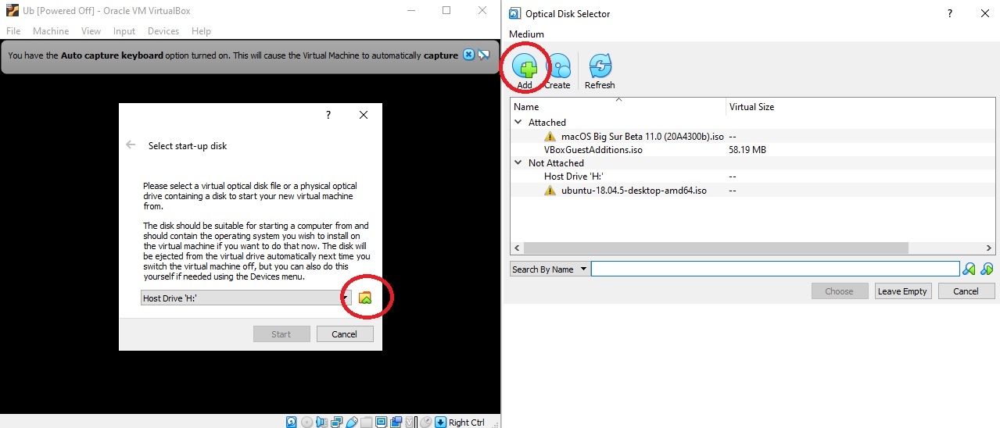

# How to Install and Create an Ubuntu Virtualbox

# What is a Virtualbox?
Virtualbox is an operating system (OS) virtualization software, an emulator that can access hardware directly, developed by the Oracle Corporation. Due to the software being open source and free, it has become one of the most popular virtualization software on the market.
# Why should you learn?
Virtualbox allows for differing OS such as Linux, macOS, and windows to be run on any computer. This allows for users to experiance new software released for specific operating systems and experiment without damaging their host OS.

## Steps

### 1. Go to VirtualBox website and download the lastest version
 - Link: https://www.virtualbox.org/wiki/Downloads
- be sure to select the OS your machine runs on called the host
> 
    
### 2. Install Virtualbox and launch it

### 3. Create a Virtualbox by slecting New
- it's located in the top right
- this opens the creation menu

### 4. Name your oeprating system
- I recommend calling it Ubuntu because the remaining fields will automatically fill out
- make sure that under version that it's Ubuntu
> 

### 5. Select the amount of RAM allocated
- this determines how much short term processing memory is allocated and how fast your machine will operate
- I like to allocate as much as possible while leaving some for my host
> 

### 6. Keep the default hard drive setting 'Create a virtual hard drive now'

### 7. Keep the default hard drive type 'VDI (Virtual Disk Image)' 

### 8. Change 'Dynamically allocated' to Fixed size
- be aware that allocating dynamically can reduce performance
- selecting Fixed Size will take time to allocate upfront
- I recommend selecting plently of memory like 100GB because I have a large hard drive
- afterward select create
> 

### 9. Download and upload the Ubuntu Disc
- This is the actual OS software provided by companies and needs to
- link: https://ubuntu.com/download/desktop
### 10. Select Ubuntu Disc and run Ubuntu
> 

